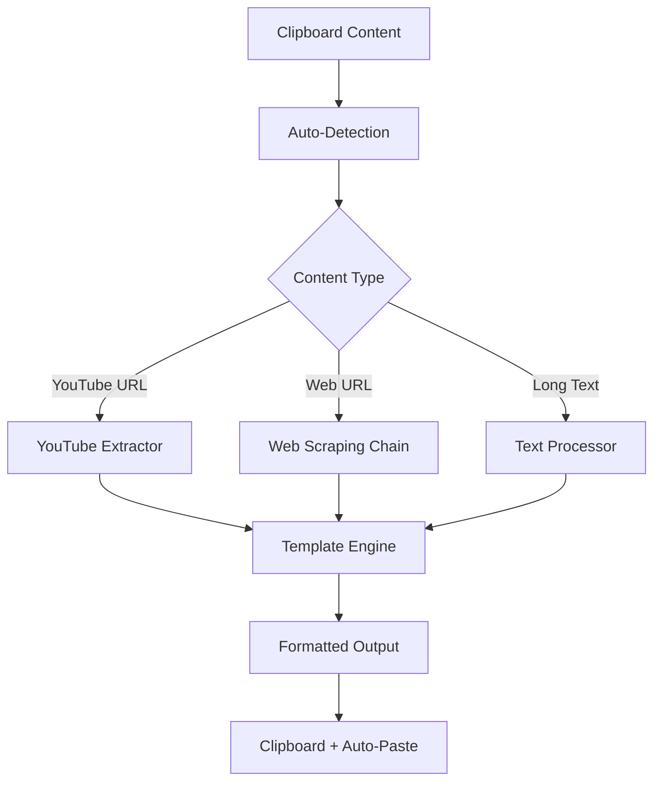

# Clipboard Template System - Project Documentation Index

## 📋 Project Overview

**clipbd-template** is a Linux desktop utility that processes various content types from the clipboard and formats them using predefined YAML templates. The application integrates with Linux desktop environments using rofi for template selection and copyq for clipboard management.

**Version:** 1.0.0  
**Python Version:** >=3.11

---

## 🏗️ Architecture Overview

### Core Components

| Component | Purpose | Key Features |
|-----------|---------|--------------|
| **main.py** | Entry point & orchestration | Template selection via rofi, content processing coordination |
| **clipbd.py** | Clipboard processing | Content extraction, auto-detection, type classification |
| **scraping.py** | Web content extraction | Fallback chain: Jina → Firecrawl → raw HTML |
| **youtube.py** | YouTube integration | Transcript extraction using youtube-transcript-api |
| **medium.py** | Medium article processing | HTML cleaning and content extraction |
| **copyq.py** | Clipboard interface | CopyQ integration for clipboard operations |

### Content Extractors

| Module | Content Type | API/Service |
|--------|-------------|-------------|
| `jina_to_md.py` | Web pages | Jina Reader API |
| `firecrawl_to_md.py` | Web content | Firecrawl service |
| `medium.py` | Medium articles | Direct HTML processing |
| `youtube.py` | Video transcripts | youtube-transcript-api |

---

## 🔄 Data Flow



---

## 📁 Project Structure

```
clipbd_template/
├── 📄 Core Application
│   ├── main.py              # Entry point & template selection
│   ├── clipbd.py            # Clipboard processing & auto-detection
│   ├── scraping.py          # Web scraping orchestrator
│   └── copyq.py             # CopyQ clipboard interface
│
├── 🔌 Content Extractors
│   ├── youtube.py           # YouTube transcript extraction
│   ├── medium.py            # Medium article processing
│   ├── jina_to_md.py        # Jina Reader API integration
│   └── firecrawl_to_md.py   # Firecrawl service integration
│
├── 📋 Templates & Assets
│   └── asset/
│       └── template2.yaml   # YAML template definitions
│
├── 🛠️ Development & Build
│   ├── pyproject.toml       # Project configuration & dependencies
│   ├── release.sh           # Build script
│   ├── test.py              # Testing utilities
│   └── test.ipynb           # Interactive development notebook
│
├── 📚 Documentation
│   ├── README.md            # Basic setup instructions
│   ├── CLAUDE.md            # Claude Code guidance
│   └── docs/                # Extended documentation
│
└── 🧪 Development
    ├── ng/                  # New features & experiments
    │   └── readerlm-v2.ipynb
    └── temp/                # Temporary files & test outputs
```

---

## 🚀 Quick Start

### Setup Environment
```bash
# Initialize Python 3.11 environment
uv sync
uv pip install ipykernel pyinstaller
```

### Development Usage
```bash
# Run with auto-detection
python main.py --auto

# Run with manual template selection
python main.py --template ~/.config/rofi/template.yaml

# Test mode
python main.py --test
```

### Build & Deploy
```bash
# Build executable
./release.sh

# Manual build
uv run pyinstaller --onefile \
    --name template_paste \
    --distpath ~/.local/bin/ \
    --specpath /tmp/ \
    main.py
```

---

## ⚙️ Configuration

### Environment Variables
Create `.env` at `~/.config/rofi/.env`:
```bash
JINA_API_JJKIM=your_jina_api_key
JINA_API_OBJECTS76=alternative_jina_key
FIRECRAWL_API_KEY=your_firecrawl_key
```

### System Dependencies
- **copyq**: Clipboard manager for content extraction
- **rofi**: GUI for template selection
- **xdotool**: Keyboard automation for pasting
- **notify-send**: Desktop notifications

---

## 🔧 API Documentation

### [Content Processing API](./API.md#content-processing)
- Content detection and classification
- Auto-detection algorithms
- Template rendering system

### [Extraction Services API](./API.md#extraction-services)
- YouTube transcript extraction
- Web scraping fallback chain
- Medium article processing

### [Clipboard Integration API](./API.md#clipboard-integration)
- CopyQ interface methods
- Clipboard data structures
- Error handling patterns

---

## 📋 Template System

### Template Structure
Templates are defined in YAML format with support for:
- **YouTube Summaries**: Timestamped navigation with Korean output
- **Web Page Analysis**: Structured content extraction
- **Meta Prompt Conversion**: LLM prompt transformation
- **Q&A Context**: Question-answering on extracted content

### Template Example
```yaml
TEMPLATES:
  youtube summary: |-
    Summarize the following YouTube video transcript...
    # Features:
    - Timestamp navigation: [19:56](https://www.youtube.com/watch?v=VIDEO_ID&t=1196s)
    - Step-by-step guides
    - Korean output
    - Technical terminology highlighting
```

---

## 🔍 Testing & Development

### Individual Component Testing
```bash
# Test specific modules
python youtube.py      # YouTube extraction
python clipbd.py       # Clipboard functions
python scraping.py     # Web scraping
python medium.py       # Medium extraction
python jina_to_md.py   # Jina API
python firecrawl_to_md.py  # Firecrawl API
```

### Interactive Development
- `test.ipynb`: Main development notebook
- `ng/readerlm-v2.ipynb`: Advanced extraction experiments

---

## 🛡️ Error Handling

### Fallback Chain Strategy
1. **Web Scraping**: Jina Reader → Firecrawl → raw HTML requests
2. **API Failures**: Multiple API keys with automatic failover
3. **Content Detection**: Auto-detection with manual override
4. **User Feedback**: Desktop notifications for errors and status

### Error Types
- **CopyQError**: Clipboard access failures
- **MediumError**: Medium article processing issues
- **DunstifyError**: Notification system failures

---

## 📊 Dependencies

### Key Python Libraries
- `youtube-transcript-api`: YouTube transcript downloading
- `firecrawl-py`: Firecrawl service client
- `pyperclip`: Cross-platform clipboard operations
- `bs4`, `lxml`: HTML parsing for Medium articles
- `requests`: HTTP client for web scraping
- `pyyaml`: Template configuration parsing
- `rich`: Enhanced terminal output

### Development Dependencies
- `pyinstaller`: Executable building
- `ipykernel`: Jupyter notebook support
- `torch`, `transformers`: ML model support (experimental)

---

## 🔗 Related Documentation

- [API Reference](./API.md) - Detailed API documentation
- [Template Guide](./TEMPLATES.md) - Template creation and customization
- [Development Guide](./DEVELOPMENT.md) - Contributing and development setup
- [Deployment Guide](./DEPLOYMENT.md) - Installation and configuration

---

## 📈 Version History

- **v1.0.0** - Initial release with YouTube, Medium, and web scraping support
- **v0.1.0** - Development version with core functionality

---

*Generated by SuperClaude /sc:index - Project Documentation System*