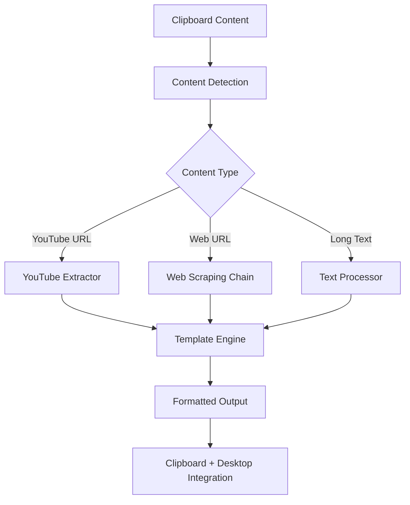

# 📋 Clipboard Template System Documentation

Complete documentation suite for the clipboard-based content extraction and template system.

---

## 🚀 Quick Navigation

### 📖 Core Documentation
- **[Project Index](./PROJECT_INDEX.md)** - Complete project overview, architecture, and quick start guide
- **[API Reference](./API.md)** - Detailed API documentation for all modules and functions  
- **[Template Guide](./TEMPLATES.md)** - Template system usage, creation, and customization

### 🔧 Development Resources
- **[Development Guide](./DEVELOPMENT.md)** - Contributing guidelines and development setup
- **[Deployment Guide](./DEPLOYMENT.md)** - Installation, configuration, and deployment instructions

---

## 📑 Documentation Structure

```
docs/
├── README.md           # This file - documentation navigation
├── PROJECT_INDEX.md    # 🏠 Main project overview and architecture
├── API.md             # 🔌 Complete API reference and usage examples
├── TEMPLATES.md       # 📝 Template system guide and customization
├── DEVELOPMENT.md     # 🛠️ Development and contributing guide
└── DEPLOYMENT.md      # 🚀 Installation and deployment instructions
```

---

## 🎯 Quick Start

### For Users
1. **Setup:** Follow [Deployment Guide](./DEPLOYMENT.md) for installation
2. **Usage:** Check [Project Index](./PROJECT_INDEX.md#quick-start) for basic usage
3. **Templates:** Use [Template Guide](./TEMPLATES.md) for customization

### For Developers  
1. **Overview:** Read [Project Index](./PROJECT_INDEX.md#architecture-overview) for system architecture
2. **API:** Reference [API Documentation](./API.md) for integration details
3. **Contributing:** Follow [Development Guide](./DEVELOPMENT.md) for contribution workflow

---

## 🏗️ System Overview

**clipbd-template** is a Linux desktop utility that processes clipboard content and formats it using YAML templates. The system supports:

- **YouTube** transcript extraction with timestamped navigation
- **Web content** scraping with multiple fallback methods
- **Medium articles** with HTML cleaning and markdown conversion
- **Custom templates** for various content processing workflows

### Key Features

✅ **Auto-Detection** - Automatically identifies content type from clipboard  
✅ **Fallback Chain** - Multiple extraction methods for reliability  
✅ **Desktop Integration** - Seamless rofi and CopyQ integration  
✅ **Template System** - Flexible YAML-based content formatting  
✅ **Multi-Language** - Supports Korean and English output  
✅ **Error Recovery** - Robust error handling with user feedback  

---

## 📊 Architecture Overview



---

## 🔧 Core Components

| Component | Purpose | Documentation |
|-----------|---------|---------------|
| **Content Detection** | Auto-detect content type from clipboard | [API.md](./API.md#content-processing-api) |
| **Extraction Services** | YouTube, web, Medium content extraction | [API.md](./API.md#extraction-services-api) |  
| **Template System** | YAML-based content formatting | [TEMPLATES.md](./TEMPLATES.md) |
| **Desktop Integration** | rofi, CopyQ, notification system | [API.md](./API.md#clipboard-integration-api) |

---

## 🚀 Development Status

### Current Version: 1.0.0

**Stable Features:**
- ✅ YouTube transcript extraction with korean output
- ✅ Web content scraping (Jina + Firecrawl + fallback)
- ✅ Medium article processing with HTML cleanup
- ✅ Template system with variable substitution
- ✅ Desktop integration (rofi, CopyQ, notifications)
- ✅ Error handling and recovery systems

**In Development:**
- 🔄 Advanced ML-based content extraction (ng/readerlm-v2.ipynb)
- 🔄 Enhanced notification system (notification_dunstify.py)
- 🔄 Additional template formats and languages

---

## 📚 Usage Examples

### Basic YouTube Processing
```bash
# Copy YouTube URL to clipboard
# Run auto-detection
python main.py --auto
# System detects YouTube URL → extracts transcript → applies template → outputs formatted summary
```

### Web Page Analysis  
```bash
# Copy web page URL to clipboard
python main.py --auto
# System detects URL → tries Jina → Firecrawl → raw HTML → applies template
```

### Custom Template Usage
```bash
# Manual template selection
python main.py --template ~/.config/rofi/template.yaml
# Shows rofi menu → select template → process clipboard content
```

---

## 🔗 Related Resources

### External Dependencies
- **[CopyQ](https://hluk.github.io/CopyQ/)** - Clipboard manager
- **[rofi](https://github.com/davatorium/rofi)** - Application launcher and menu
- **[Jina Reader](https://jina.ai/reader/)** - Web content extraction API
- **[Firecrawl](https://firecrawl.dev/)** - Web scraping service

### Python Libraries
- **[youtube-transcript-api](https://pypi.org/project/youtube-transcript-api/)** - YouTube transcript extraction
- **[BeautifulSoup4](https://pypi.org/project/beautifulsoup4/)** - HTML parsing
- **[PyYAML](https://pypi.org/project/PyYAML/)** - YAML configuration parsing

---

## 🤝 Contributing

We welcome contributions! Please see:

1. **[Development Guide](./DEVELOPMENT.md)** - Setup and contribution workflow
2. **[API Reference](./API.md)** - Technical implementation details  
3. **[Template Guide](./TEMPLATES.md)** - Template development and testing

### Quick Contribution Steps
```bash
# 1. Fork and clone repository
git clone https://github.com/your-username/clipbd_template.git

# 2. Setup development environment  
uv sync
uv pip install ipykernel pyinstaller

# 3. Make changes and test
python main.py --test

# 4. Submit pull request
```

---

## 📄 License & Support

**Project License:** Check repository root for license information

**Support Channels:**
- 📖 **Documentation:** This documentation suite
- 🐛 **Issues:** GitHub issue tracker  
- 💡 **Feature Requests:** GitHub discussions
- 🔧 **Development:** Check [Development Guide](./DEVELOPMENT.md)

---

## 📊 Documentation Metrics

- **Total Documentation Files:** 6
- **API Functions Documented:** 25+
- **Template Examples:** 10+
- **Usage Examples:** 15+
- **Architecture Diagrams:** 2

---

*Generated by SuperClaude /sc:index - Documentation Navigation System*